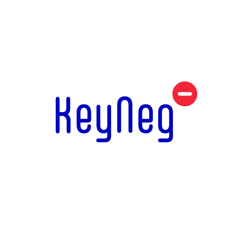

<p align="center">
  
</p>

<h1 align="center">KeyNeg</h1>

<p align="center">
  <strong>A KeyBERT-style Negative Sentiment and Keyword Extractor for Workforce Intelligence</strong>
</p>

<p align="center">
  <a href="https://pypi.org/project/keyneg/"></a>
  <a href="https://pypi.org/project/keyneg/"></a>
  <a href="https://pypistats.org/packages/keyneg"></a>
  <a href="https://github.com/Osseni94/keyneg/blob/main/LICENSE"></a>
</p>

---

**Author:** Kaossara Osseni
**Email:** admin@grandnasser.com

KeyNeg extracts negative keywords, frustration indicators, and discontent signals from text. Designed for analyzing employee feedback, forum discussions, customer reviews, and more.

## Installation

```bash
# Install from PyPI
pip install keyneg

# With the Streamlit app
pip install keyneg[app]

# With the polarity classifier (DistilBERT-SST2 ONNX, ~250MB on first run)
pip install keyneg[polarity]

# Everything
pip install keyneg[all]
```

> **What's new in 1.2** — see [CHANGELOG](#whats-new-in-12) at the bottom.
> Headline: real polarity classification (`polarity_filter=True`),
> negation-aware detectors (`"I'm not quitting"` no longer trips departure
> intent), score-bound fixes, deepcopy-isolated taxonomies per instance,
> and a 100+ test suite.

## Quick Start

```python
from keyneg import KeyNeg

# Initialize (uses all-mpnet-base-v2 by default)
kn = KeyNeg()

# Extract negative sentiments
sentiments = kn.extract_sentiments(
    "I'm frustrated with the constant micromanagement and lack of recognition"
)
print(sentiments)
# [('micromanagement', 0.72), ('frustration', 0.68), ('lack of recognition', 0.65), ...]

# Extract negative keywords
keywords = kn.extract_keywords(
    "The toxic culture and burnout is unbearable"
)
print(keywords)
# [('toxic culture', 0.81), ('burnout', 0.75), ('unbearable', 0.62), ...]

# Full analysis (topic-similarity only — fast, no extra deps)
result = kn.analyze("My manager never listens and I'm thinking of quitting")
print(result)
# {
#     'keywords': [...],
#     'sentiments': [...],
#     'top_sentiment': 'poor leadership',
#     'topic_match_score': 0.65,
#     'negativity_score': 0.65,           # alias of topic_match_score for back-compat
#     'polarity_score': 0.0,              # 0 until polarity_filter is on
#     'polarity_filter_applied': False,
#     'negative_sentences': [],
#     'categories': ['work_environment_culture', 'job_satisfaction']
# }

# With real polarity classification (requires `pip install keyneg[polarity]`):
result = kn.analyze(
    "I had a great session about preventing burnout today.",
    polarity_filter=True,
)
# {
#     ...,
#     'polarity_score':  0.82,            # net-positive sentence ⇒ classifier says non-negative
#     'polarity_filter_applied': True,
#     'topic_match_score': 0.0,           # nothing tagged because nothing was negative
#     'sentiments': [],
#     'keywords': [],
# }
```

### Score interpretation — read this once

| Field                  | Range  | Meaning                                                                                  |
|------------------------|--------|------------------------------------------------------------------------------------------|
| `topic_match_score`    | [0, 1] | Mean cosine similarity of the doc to detected negative-sentiment labels. **Topical** overlap with negative themes — not polarity. |
| `polarity_score`       | [-1,1] | Signed polarity from the classifier (positive = positive tone, negative = negative). Populated only when `polarity_filter=True`. |
| `negativity_score`     | [0, 1] | Backward-compat alias of `topic_match_score`. Prefer the new name in new code.           |

The earlier `negativity_score` name overstated what cosine similarity to
negative-sounding labels can tell you. Without `polarity_filter=True` the
score still measures topical overlap; with it on, you also get a real
polarity reading from a fine-tuned DistilBERT-SST2 classifier.

## Features

### Sentiment Extraction

Extract predefined negative sentiment categories:

```python
sentiments = kn.extract_sentiments(
    text,
    top_n=5,           # Number of results
    threshold=0.3,     # Minimum similarity score
    diversity=0.0      # MMR diversity (0-1)
)
```

### Keyword Extraction

Extract negative keywords from both taxonomy and document:

```python
keywords = kn.extract_keywords(
    text,
    top_n=10,
    threshold=0.25,
    keyphrase_ngram_range=(1, 2),
    use_taxonomy=True,
    diversity=0.0
)
```

### Batch Processing

Efficiently process multiple documents:

```python
docs = ["Comment 1...", "Comment 2...", "Comment 3..."]

# Batch analysis
results = kn.analyze_batch(docs, show_progress=True)

# Or individually
keywords_batch = kn.extract_keywords_batch(docs)
sentiments_batch = kn.extract_sentiments_batch(docs)
```

### Special Detectors (negation-aware as of v1.2)

All three detectors run a token-level negation-scope analysis before
matching. Phrases that fall inside a negation window (`not`, `no`, `never`,
`without`, contractions like `don't`/`can't`, etc.) are skipped.

**Departure Intent Detection:**
```python
kn.detect_departure_intent("I'm updating my resume and interviewing")
# {'detected': True, 'confidence': 0.67, 'signals': ['updating resume', 'interviewing']}

kn.detect_departure_intent("I'm not quitting")               # simple negation
# {'detected': False, 'confidence': 0.0, 'signals': []}

kn.detect_departure_intent("He's no longer thinking about quitting")  # multi-word
# {'detected': False, 'confidence': 0.0, 'signals': []}

kn.detect_departure_intent("I am not never quitting tomorrow")   # double-negative cancels
# {'detected': True, 'confidence': 0.33, 'signals': ['quitting']}
```

**Domain-specific negators** — for legal/regulatory text:
```python
kn = KeyNeg(extra_negation_tokens=["notwithstanding"])
kn.detect_escalation_risk("Notwithstanding any lawyer involvement")
# {'detected': False, 'risk_level': 'low', 'signals': []}
```

**Escalation Risk Detection:**
```python
kn.detect_escalation_risk("I'm contacting my lawyer about this")
# {'detected': True, 'risk_level': 'medium', 'signals': ['contact my lawyer']}

kn.detect_escalation_risk("I'm not contacting any lawyer")  # negation-aware
# {'detected': False, 'risk_level': 'low', 'signals': []}
```

**Intensity Analysis:**
```python
kn.get_intensity("I'm absolutely furious about this")
# {'level': 3, 'label': 'strong', 'indicators': ['furious']}
```

## Taxonomy Categories

KeyNeg includes a comprehensive taxonomy covering:

- **Work Environment & Culture**: toxic culture, harassment, discrimination, favoritism
- **Management Issues**: micromanagement, poor leadership, lack of direction
- **Recognition & Value**: undervalued, unappreciated, credit stolen
- **Workload & Burnout**: exhaustion, overwhelmed, unrealistic deadlines
- **Compensation**: underpaid, pay disparity, poor benefits
- **Career Development**: no growth, dead end job, glass ceiling
- **Work-Life Balance**: excessive hours, no flexibility
- **Team Dynamics**: conflict, poor collaboration, isolation
- **Job Satisfaction**: low morale, frustration, disengagement
- **Customer/Product Issues**: poor quality, bad service, overpriced

## Customization

### Add Custom Labels

```python
kn.add_custom_labels(["impostor syndrome", "quiet firing"])
```

### Add Custom Keywords

```python
kn.add_custom_keywords("tech_specific", [
    "pager duty", "on-call nightmare", "technical debt"
])
```

### Use Custom Model

```python
kn = KeyNeg(model="all-MiniLM-L6-v2")  # Faster, slightly less accurate
```

## Utility Functions

```python
from keyneg.utils import (
    highlight_keywords,      # Highlight detected keywords in text
    score_to_severity,       # Convert score to severity label
    aggregate_batch_results, # Aggregate batch statistics
    export_to_json,          # Export results to JSON
    export_batch_to_csv,     # Export batch to CSV
    preprocess_text,         # Clean/preprocess text
    chunk_text,              # Split long text into chunks
)

# Highlight keywords in HTML
highlighted = highlight_keywords(text, keywords, format="html")

# Get severity
severity = score_to_severity(0.75)  # "critical"

# Aggregate batch results
summary = aggregate_batch_results(results)
print(summary['top_sentiments'])
print(summary['avg_negativity_score'])
```

## Streamlit App

After `pip install keyneg[app]`, launch the interactive UI via the
installed entry point:

```bash
keyneg-app
```

(Equivalent to `python -m streamlit run keyneg/app.py` against the
package-internal app module.)

Features:
- Single text analysis with detailed results
- Batch processing with file upload
- Interactive visualizations
- Export results to CSV

## Use Cases

1. **Employee Survey Analysis**: Identify patterns of dissatisfaction across responses
2. **Exit Interview Processing**: Extract reasons for departure at scale
3. **Forum Monitoring**: Track sentiment on workforce forums (e.g., TheLayoffradar.com, Blind)
4. **Customer Feedback**: Analyze product reviews and support tickets
5. **Social Media Monitoring**: Track brand sentiment and complaints

## API Integration

```python
from fastapi import FastAPI
from keyneg import KeyNeg

app = FastAPI()
kn = KeyNeg()

@app.post("/analyze")
def analyze(text: str):
    return kn.analyze(text)

@app.post("/analyze_batch")
def analyze_batch(texts: list):
    return kn.analyze_batch(texts)
```

## Limitations & known gaps

Read this before deploying:

- **Cosine similarity ≠ polarity.** Without `polarity_filter=True`, a
  document discussing *"burnout prevention"* will topically match the
  `burnout` label. That's by design: `topic_match_score` is a *topic*
  signal, not a polarity signal. Pass `polarity_filter=True` (with the
  `polarity` extra installed) to get a real polarity reading.
- **Thresholds are starting points, not constants.** `0.25` for keywords
  and `0.3` for sentiments work for English HR/feedback text. Tune them
  to your domain — there is no universally calibrated number for
  sentence-transformer cosine similarity.
- **Negation handling is window-based, not parser-based.** The 4-token
  window catches *"I'm not quitting"* and *"no plans to leave"* reliably
  but will miss long-range negation across multiple clauses.
- **Detectors are recall-oriented.** They flag candidates for review —
  they aren't classifiers. Human-in-the-loop review is recommended for
  any consequential decision.

## What's new in 1.3

- **Major negation upgrade** — algorithm ported from ONES-rs (the
  Rust-based NLP engine in our research repo). New cases handled:
  - **Multi-word phrases** — `lack of escalation plans`, `failed to
    address harassment`, `no longer thinking about quitting`, `by no
    means`, `unable to`, `have no`, `without any`, etc. all open
    negation scope from the *end* of the phrase.
  - **Multi-word walls** — `on the other hand`, `despite the fact`,
    `even though`, `in contrast` close the negation scope mid-sentence.
  - **Double-negation cancellation** — `not never quitting` (count = 2)
    leaves `quitting` unnegated. `not unhappy about escalating` leaves
    `escalating` unnegated.
  - **Comma as wall** — clause boundary that resets scope, not just `.`/`?`/`!`.
  - **Verbal negators** — `refused`, `prevented`, `denied`, `rejected`,
    `failed`, `rarely`, `hardly`, `scarcely`.
  - **Domain-specific cues** — pass `extra_negation_tokens=[...]` to the
    constructor to add custom negators (legal/regulatory text,
    industry idioms).
- **Polarity layer (optional, from 1.2)** — `pip install keyneg[polarity]` adds an
  ONNX DistilBERT-SST2 classifier. Pass `polarity_filter=True` to
  `analyze()` for a polarity-first pipeline (split → classify →
  filter → tag).
- **Negation-aware detectors** — `detect_departure_intent`,
  `detect_escalation_risk`, and `get_intensity` honor the upgraded
  scope analysis.
- **Score capped at 1.0** — the 1.2× boost on taxonomy-matched
  candidates can no longer push cosine scores above 1.0.
- **Deepcopy-isolated taxonomies** — `add_custom_keywords` no longer
  leaks across instances. `all_keywords` now reads from the per-instance
  taxonomy, so customizations actually surface in extraction.
- **Cached lowercase keyword set** — extracted to a property; not
  rebuilt on every call.
- **Score field clarification** — `topic_match_score` is the new
  primary name; `negativity_score` is kept as an alias.
- **Packaging cleanup** — single `pyproject.toml` source of truth (no
  more `setup.py`); the Streamlit app moved into the package as
  `keyneg/app.py` and is launched via the `keyneg-app` console script.
- **100+ test suite** — pytest with regressions for every fix above,
  plus GitHub Actions CI on Python 3.9–3.12.

## License

MIT License

## Author

**Kaossara Osseni**
Email: admin@grandnasser.com
GitHub: https://github.com/Osseni94
